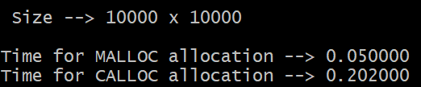

### Сравнение времени работы выделения памяти под матрицу функциями `calloc` и `malloc` ###

Для замера был создан файл time_allocate.c.
Замер проихводился с помощью функции _clock_ из библиотека _time.h_

Измерение производились на матрице размером *10000х10000* элементов.
Как показал экперимент, выделение с помощью malloc производится 
в среднем в 4 раза быстрее, чем с помощью calloc.

